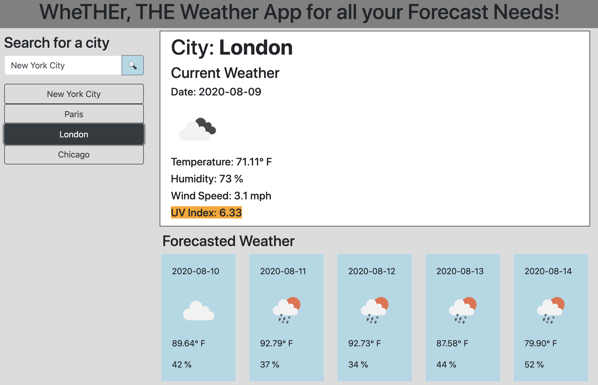

# Weather Dashboard

## Introduction
We were tasked with creating a web application that would display current and forecasted weather. To obtain this information, we were taksed with utilizing mutliple AJAX calls using APIs (such as OpenWeather, etc). The weather data would be saved to localStorage, and could be recalled even as further searches were performed. Numerous javascript functions were utilizing to dynamically display the content, and Bootstrap was utilized to ensure a responsive page layout.

## Deployed Application:
###
[https://jpbrickhouse.github.io/Weather-Dashboard/](https://jpbrickhouse.github.io/Weather-Dashboard/)

## Screenshot:

## Overall Notes

### index.html
- Bootstrap CSS and custom CSS files are referenced
- jQuery and Moment.js CDNs are referenced
- Custom javascript (script2.js) is referenced
- The entire document is a container, with several divs to hold the following content:
    - App Title
    - Search Bar and Search Button
    - Search history buttons
    - Current Weather
    - Cards for the Forecasted Weather
- Several additional pieces of html are generated via the javascript (script2.js)

### style.css
The majority of the CSS file consists of code to set styles for the website document: margins, padding, background colors, borders, font-weights, etc. However, one portion of the CSS file contains background color styles for the UV Index. In the script2.js file, once the UV index is determined from the AJAX call, a series if / else statements sets the class of a span in the html document. Depending on the class, a different background color is set, per the CSS file.

### script2.js
The javascript file contains of several functions, each of which do the following:
- buildGeoCodeQueryURL() - Taking the user input from the search bar (a city, address, etc., building the queryURL, and returning the queryURL
- geocoding() - Using the Geocode queryURL to make an AJAX call with the OpenCageData Geocode API and returning coordinates (latitude and longitude))
- buildWeatherQueryURL() - Using the returned coordiantes from geocoding(), building the queryURL, and returning the queryURL
- There is an event listener associated with the search button. Once clicked, the weather queryURL is used to make an AJAX call to the OpenWeatherAPI. As a result, the getWeather function runs, the renderButtons function runs, and the displayWeatherData function runs
- getWeather() - This function takes the results of the AJAX call from OpenWeatherAPI, and parses through them. It builds weatherArray consisting of current and forecasted weather, which includes temperature, humidity, wind speed, UV index, and picture icons representing the weather. It stores this weatherArray in localStorage for future recall.
- displayWeatherData() - This function retrieves everything from localStorage and displays the current and forecasted weather based on the city in question
- renderButtons() - After the user searches for a city, this function creates a button (rendered with the name of the city) on the left side column, allowing the user to click that button.
- An event listener is added for all generated buttons; once the user clicks the button, the setCityFetchData function runs.
- setCityFetchData() - this function runs the the displayWeatherData() function. As such, this means that clicking a button in the left side column ultimately results in the forecasted weather being displayed.
- lastSearchDisplayed() - this function runs automatically upon opening the page. It parses through localStorage for the last searched city and then displays the associated weather forecast information.

## Final Thoughts
- Homework 6 was an excellent exercise, requiring us to synthesize all the previous lessons and homeworks.
- There were some struggles with asynchronous behavior, where certain functions would finish running before others. As a result, I had to do some research into async and await commands. Although I'm still learning the basics regarding their usage, for now they appear to be implemented successfully.
- Further notes have been commented upon with the code itself.
